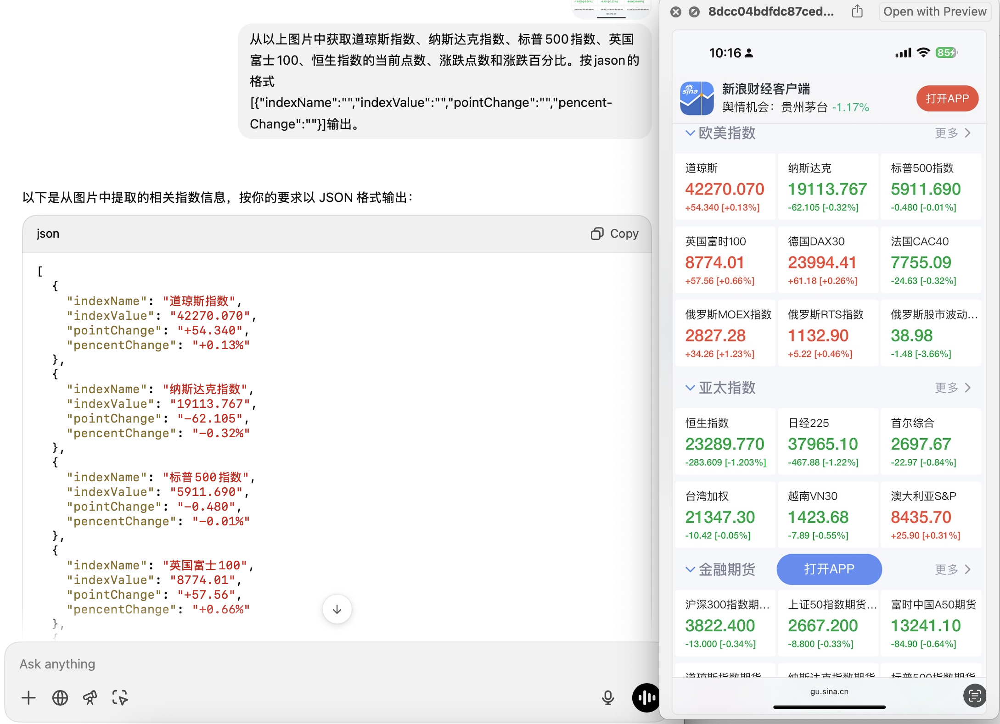

# Webbora Project


> 尝试过的方案：
>
> 1. migrate Wind terminal to Linux
> 2. free data source: 
>    1. vantage API: https://www.alphavantage.co/ 只有美股
>    2. [YahooFinanceAPI](https://mvnrepository.com/artifact/com.yahoofinance-api/YahooFinanceAPI) : 官方已经停止维护，社区版(原理也是分析yahoo finance的webpage)测试不成功 
>    3. 12data: https://twelvedata.com/ 能成功拿到部分数据，但确实很多指数 
>    4. 同花顺(https://q.10jqka.com.cn/ , https://q.10jqka.com.cn/global)、新浪财经(https://gu.sina.cn/#/world)、Wind web page ......
>       英为财情 https://cn.investing.com/indices/major-indices // 可以下载csv，但有反爬
>       Wind: https://www.wind.com.cn/mobile/WDS/sapi/en.html
>    5. get index value from screen capture by AI

AI Parse Screen Capture | json
----------------------------------- | ---------------------------
 | json 

```json
[{
    "indexName": "道琼斯指数",
    "indexValue": "42270.070",
    "pointChange": "+54.340",
    "pencentChange": "+0.13%"
  },
  {
    "indexName": "纳斯达克指数",
    "indexValue": "19113.767",
    "pointChange": "-62.105",
    "pencentChange": "-0.32%"
  }]
```


> **在Linux上测试自动截取网页图片**
>
> > 1. node.js + cypress
> > 2. python + selenium

